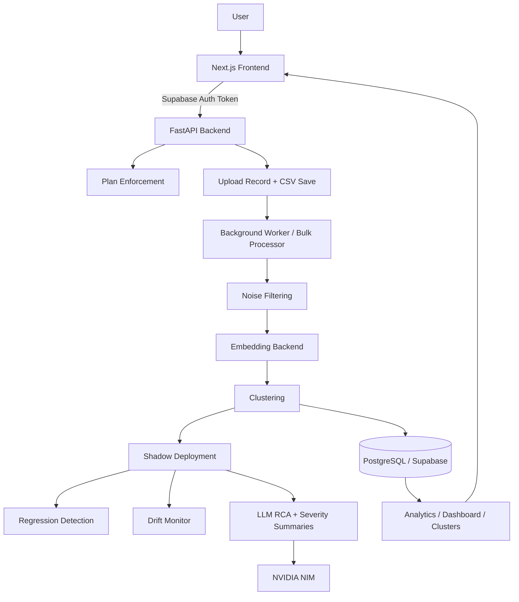

# Roast Google Reviews - Comprehensive Project Overview

## Purpose

Roast is a review intelligence platform that turns raw app store reviews into structured engineering work. It ingests CSV files, cleans and clusters feedback, assigns severity, generates AI explanations, runs shadow validation, and exposes everything through a dashboard and analytics UI.

This document is meant to be the single high-detail reference for the current codebase: architecture, features, data flow, runtime behavior, UI surfaces, backend services, persistence model, safety rails, and configuration.

## What the Product Does

At a user level, the product does the following:

- Authenticates users with Supabase.
- Lets users upload review CSV files.
- Enforces monthly upload and review limits by plan.
- Processes the file into clusters of similar issues.
- Filters noise such as generic praise, spam, and very short reviews.
- Extracts metadata such as version and device when available.
- Assigns severities to clusters: critical, high, medium, low.
- Generates per-severity AI summaries.
- Generates per-cluster RCA notes for critical and high issues.
- Runs shadow deployment and drift monitoring for validation.
- Displays dashboard, analytics, clusters, upload history, and AI debug views.
- Exports structured data to CSV and PDF, and supports issue-oriented workflows.

## Current Tech Stack

### Backend

- FastAPI
- Python 3.13 style codebase, running in a virtual environment
- SQLModel and SQLAlchemy
- PostgreSQL via Supabase
- Pydantic
- httpx
- python-dotenv
- openai SDK for NVIDIA OpenAI-compatible API access
- pandas
- numpy
- scikit-learn
- Supabase Auth integration

### Frontend

- Next.js App Router
- React 19
- TypeScript
- Tailwind CSS
- Framer Motion
- Supabase browser client
- Lucide icons
- Three.js related components for visual effects

### AI / ML / Data

- HuggingFace Inference API for embeddings when available
- TF-IDF + SVD fallback for embeddings when HF is unavailable
- NVIDIA NIM OpenAI-compatible endpoint for RCA generation
- In-memory cosine clustering / nearest-neighbor style grouping
- Drift monitoring and adversarial content checks

### Infrastructure

- Supabase for auth and PostgreSQL
- Vercel-style frontend deployment patterns
- Backend served with Uvicorn
- Local CSV file uploads stored temporarily on disk
- Shadow deployment artifacts written to a production shadow results folder

## Repository Shape

### Top-Level Areas

- `backend/` - FastAPI backend, workers, services, models, migrations, shadow orchestration
- `frontend/` - Next.js app and UI components
- `dataset/` - training and adversarial CSVs
- `extra/` - documentation, architecture notes, audits, migration guides, helper scripts
- `chatgpt_reviews-200k.csv` - sample large dataset

### Backend Structure

- `backend/app/main.py` - FastAPI entrypoint
- `backend/app/api/` - bulk API wiring
- `backend/app/routes/` - auth and plan routes
- `backend/app/services/` - bulk processing, embeddings, LLM service, RCA pregeneration, cache
- `backend/app/models/` - SQLModel models
- `backend/app/core/` - config, plans, shadow deployment integration
- `backend/app/workers/` - worker loop and resource tracking
- `backend/src/` - newer DI-based architecture
- `backend/migrations/` - SQL migrations
- `backend/shadow_results_production/` - shadow deployment outputs

### Frontend Structure

- `frontend/src/app/` - App Router pages
- `frontend/src/components/` - reusable UI components
- `frontend/src/lib/` - API client and Supabase clients
- `frontend/src/middleware.ts` - middleware logic if present in the app shell

## High-Level Architecture

## Execution Model

The system is hybrid and has two backend generations:

- v1 legacy bulk pipeline is still the main active runtime path.
- v2 is a DI-based architecture in `backend/src/` that can be bootstrapped when enabled.
- v3 is not a separate full pipeline in the user-facing app, but exists as monitoring logic and shadow validation.

At startup, the backend does the following:

1. Initializes the bulk API.
2. Initializes the database engine.
3. Starts the background worker.
4. Optionally boots the newer DI container.
5. Registers v1 routes and optionally v2 routes.
6. Adds architecture routing middleware when available.

## Backend Startup

### `backend/app/main.py`

This is the main FastAPI application.

Key responsibilities:

- Configures structured logging.
- Runs a lifespan startup hook.
- Initializes bulk upload API support.
- Starts the background worker.
- Optionally bootstraps the v2 architecture container.
- Registers auth and plan routers.
- Adds v2 upload routes when enabled.
- Configures CORS for local development, Vercel, and roast.systems.
- Exposes root and health endpoints.

### Startup Behavior

On startup, the backend expects:

- Supabase database credentials
- Supabase Auth / profile integration
- Upload storage path
- LLM credentials for NVIDIA
- Embedding credentials if using HuggingFace inference

## Backend Configuration

### `backend/app/core/config.py`

This config object controls the legacy bulk pipeline.

It defines:

- `DATABASE_URL`
- `MODEL_NAME`
- `BATCH_SIZE`
- `NUM_WORKERS`
- `COSINE_THRESHOLD`
- `MIN_TEXT_LENGTH`
- `WORKER_POLL_INTERVAL`
- `UPLOAD_DIR`
- `MAX_UPLOAD_SIZE_MB`
- keyword lists for noise filtering

The config is optimized for production-ish bulk review processing with relatively strict filtering.

### `backend/src/bootstrap.py`

This is the newer architecture bootstrap.

It wires:

- embedding providers
- vector stores
- clustering engines
- actionability scorers
- ranking strategies
- event bus
- dependency injection container

This is a more modular architecture than the legacy bulk path, but the currently active product flow is still the bulk pipeline.

## Authentication and User Model

### Supabase Auth

The backend auth routes integrate with Supabase Auth. Users can sign up, log in, refresh tokens, and fetch current profile information.

Routes include:

- `POST /auth/signup`
- `POST /auth/login`
- `POST /auth/google`
- `GET /auth/me`
- `POST /auth/refresh`
- `POST /auth/logout`

### Backend Auth Storage

Profiles live in the `profiles` table and are represented by a profile model in the backend.

The auth layer is responsible for:

- creating profiles on signup
- mapping provider metadata
- reading the authenticated user for protected routes
- attaching the user to upload and plan operations

## Plan Enforcement

### `backend/app/routes/plan_routes.py`

The product has plan-based limits.

The plan route system provides:

- current plan info
- uploads used this month
- plan label
- upload limit
- review limit
- reset date
- plan update endpoint

This is tied to the upload enforcement logic so users cannot exceed their quota.

### Plan Enforcement Happens During Upload

Before processing a file, the backend checks:

- monthly uploads used
- row count / review count of the file
- whether the plan is unlimited or capped

If a user exceeds limits, the API returns HTTP 402 with a structured error code such as:

- `UPLOAD_LIMIT_REACHED`
- `REVIEW_LIMIT_EXCEEDED`

## Upload Flow

### `backend/app/api/bulk_api.py`

This module initializes the bulk subsystem:

- creates the database engine
- creates tables
- ensures upload directory exists
- registers bulk routes

### `backend/app/api/bulk_routes.py`

This is the primary user-facing upload and retrieval API.

Important routes:

- `POST /upload`
- `GET /uploads`
- `GET /uploads/{id}/progress`
- `GET /uploads/{id}/clusters`
- `GET /uploads/{id}/severity-explanations/{severity}`
- `GET /clusters/{id}`
- `GET /clusters/{id}/explain`
- `GET /health/db`

### Upload Processing Steps

1. User uploads a CSV.
2. File type is validated.
3. Plan limits are checked.
4. File size is checked.
5. Review count is estimated.
6. Upload row is created with status `shadow_processing`.
7. File is written to the upload directory.
8. Shadow deployment is scheduled.
9. Background processing eventually marks the upload as completed or failed.

## Bulk Processing Pipeline

### `backend/app/services/bulk_processor.py`

This is the core review processing engine.

It performs:

- CSV loading
- schema detection
- noise filtering
- batch embedding
- in-memory clustering
- cluster persistence

### Detailed Stage Breakdown

#### 1. CSV Loading

The CSV loader detects review text columns and normalizes schema names.

It can map columns such as:

- `content`
- `review`
- `text`
- `message`
- `comment`
- `feedback`
- `body`

It also maps optional metadata columns such as:

- `reviewId`
- `userName`
- `score`
- `appVersion`
- `thumbsUpCount`

If no obvious content column exists, it uses heuristic fallback based on average text length.

#### 2. Noise Filtering

The processor removes reviews that are likely not useful for issue detection.

Noise rules include:

- too short reviews
- generic praise
- positive-only comments
- spam-like content
- high-star reviews with no negative indicators

The code also preserves negative reviews even if they contain otherwise positive wording when negative keywords are present.

#### 3. Embedding

The kept reviews are converted into semantic vectors through the embedding backend.

#### 4. Clustering

The embeddings are clustered in memory using nearest-neighbor style logic and cosine similarity thresholds.

#### 5. Persistence

The resulting clusters are written to the database, along with metadata such as:

- title
- severity
- review count
- sample reviews
- affected versions/devices
- keywords
- RCA fields

### Why This Matters

This pipeline is optimized for bulk processing and avoids per-review database writes, which keeps it fast enough for large CSV uploads.

## Embedding Backend

### `backend/app/services/bulk_embedding.py`

The embedding system has two tiers:

#### Tier 1: HuggingFace Inference API

If `HUGGINGFACE_API_KEY` is set, the service uses the HuggingFace hosted embedding endpoint for `sentence-transformers/all-MiniLM-L6-v2`.

Benefits:

- no local torch dependency
- good embedding quality
- consistent 384-dimensional vectors

#### Tier 2: TF-IDF + SVD Fallback

If HuggingFace is not available, the service falls back to:

- TF-IDF vectorization
- Truncated SVD
- L2 normalization

This keeps the app runnable even without external embedding APIs.

### Embedding Behavior

- batch processing is supported
- failures fall back gracefully
- the runtime avoids loading torch
- embeddings are used for clustering, not just for AI debug features

## LLM Service

### `backend/app/services/llm_service.py`

The current AI text generation path uses NVIDIA NIM via an OpenAI-compatible endpoint.

Current behavior:

- reads `NVIDIA_API_KEY`
- uses `https://integrate.api.nvidia.com/v1`
- defaults to model `meta/llama-3.1-8b-instruct`
- applies small retry logic
- rate limits requests lightly
- returns a safe fallback text if the model is unavailable

This service is the single route for:

- severity summaries
- cluster RCA notes
- other user-facing AI explanation prompts

## AI Severity Summaries

### `backend/app/services/explanation_pregenerate.py`

This service pre-generates severity summaries and per-cluster RCAs after a successful bulk upload.

### Severity Summaries

For each upload, it can generate summaries for:

- critical
- high
- medium
- low

The prompts are structured to produce:

- overview
- top issues
- common thread
- action required

These summaries are stored in the database and cached in memory.

### Per-Cluster RCA

For critical and high clusters, the service generates a structured RCA with sections like:

- root cause hypothesis
- affected surface area
- reproduction steps
- diagnostic checklist
- recommended fix
- prevention
- notes

It uses the LLM service, persists the result back to the cluster record, and marks the cluster as analyzed.

## Shadow Deployment and Validation

### `backend/app/core/shadow_deployment.py`

This is the production safety layer.

Its responsibilities:

- runs shadow deployment on each upload
- compares pipeline outputs
- copies clusters from shadow/auxiliary output into the user-facing upload record
- runs regression detection against prior resolved issues
- deletes raw CSV after processing
- triggers AI pre-generation for severities and RCAs

### Regression Detection

Regression detection compares new cluster titles with previously resolved clusters for the same user.

If the similarity crosses a threshold, the cluster is marked as a regression of a previous issue.

This powers the “fix verification loop” behavior.

### Shadow Output

Shadow deployment writes comparison artifacts to the production shadow results directory.

## Drift Monitoring

### `backend/drift_monitor.py`

The drift monitor compares a baseline dataset with a current dataset to detect shifts such as:

- rating distribution drift
- review length drift
- duplicate or coordinated review spam
- very short spam review floods

It writes JSON reports for drift and adversarial detection.

This is part of the product’s safety and quality assurance strategy.

## Data Model

### `backend/app/models/bulk_models.py`

The main tables are:

#### Upload

Represents a single review CSV upload.

Important fields:

- id
- user_id
- filename
- file_size_bytes
- total_reviews
- status
- error_message
- processed_reviews
- filtered_noise
- clusters_created
- ai_analyzed_count
- processing_time_ms
- processing_time_seconds
- created_at
- completed_at

#### Cluster

Represents a group of semantically similar reviews.

Important fields:

- id
- upload_id
- cluster_uuid
- title
- severity
- status
- rca_title
- rca_hypothesis
- rca_steps
- rca_fix
- ai_analyzed
- affected_versions
- affected_devices
- keywords
- sample_reviews
- review_count
- assigned_to
- assigned_at
- regression_detected
- regression_of_title
- created_at
- updated_at
- resolved_at

#### SeverityExplanation

Stores pre-generated severity summaries.

Fields:

- upload_id
- severity
- status
- explanation
- generated_at
- created_at

#### Review

Represents individual reviews if stored in a more granular workflow.

### Persistence Notes

The codebase currently uses clustered review storage heavily, with review-level persistence being optional or legacy depending on flow.

## Frontend Architecture

### App Shell

The frontend uses Next.js App Router and is split into marketing pages and authenticated app pages.

### Global Layout

`frontend/src/app/layout.tsx` configures:

- custom Google fonts
- preloader
- cursor glow effect
- theme provider
- app metadata

### Main Frontend Sections

- marketing landing page
- login page
- upload page
- dashboard page
- analytics page
- clusters page
- AI debug page
- settings page
- pricing page
- docs page

## Frontend Authentication Flow

### Browser Supabase Client

The browser uses a Supabase client to:

- check auth state
- sign in with Google
- sign in with GitHub
- fetch the current session token
- attach the token to backend API calls

### Auth Behavior

- authenticated users can access the app area
- unauthenticated users are redirected to login or can use the marketing page CTA
- the marketing page switches buttons depending on auth state

## Frontend Pages

### Marketing Page

`frontend/src/app/(marketing)/page.tsx`

Features:

- cinematic landing page
- animated hero
- phone mockup section
- feature cards
- Google and GitHub sign-in buttons
- dashboard CTA if authenticated
- gradient / motion-heavy visual language

This page is the public entry point and explains the product to new users.

### Upload Page

`frontend/src/app/(app)/upload/page.tsx`

Features:

- CSV upload UI
- upload progress polling
- plan limit error handling
- redirect to analytics when processing is complete
- integration with backend upload endpoint

### Dashboard Page

`frontend/src/app/(app)/dashboard/page.tsx`

Features:

- authenticated user summary
- KPI cards
- usage dashboard
- kanban board showing roast history
- live fetched uploads and clusters
- severity counts and resolved issue tracking

### Analytics Page

`frontend/src/app/(app)/analytics/page.tsx`

Features:

- severity distribution
- recent activity
- cluster drill-down
- spike detection logic
- export to CSV and PDF
- on-demand cluster detail loading
- ticket export modal flow

### Clusters Page

`frontend/src/app/(app)/clusters/page.tsx`

Features:

- upload history
- per-upload cluster preview
- delete upload flow
- severity badges
- status badges
- upload metadata display

### AI Debug Page

`frontend/src/app/(app)/ai-debug/page.tsx`

Features:

- per-severity explanation access
- cluster RCA-style triage helper
- structured prompt builder
- debugging and deeper analysis workflow

### Settings and Pricing

These pages provide configuration, plan visibility, and user-facing product information.

## Frontend Components

### UI Components

Reusable components include:

- SpotlightCard
- KanbanBoard
- EmptyState
- TicketCard
- Preloader
- CursorGlow
- TicketExportModal
- TextReveal

### Layout Components

The app uses a visually distinctive layout system:

- top navigation
- glassmorphism-style cards
- animated backgrounds
- cinematic marketing components

### Dashboard Components

The usage dashboard fetches plan data from the backend proxy endpoint and visualizes:

- current plan
- uploads used
- upload limit
- review limit
- days until reset

## Frontend API Integration

### `frontend/src/lib/api-client.ts`

This client centralizes backend calls.

It supports:

- signup
- login
- logout
- current user lookup
- upload CSV
- get uploads
- get upload progress
- get clusters for an upload
- get cluster details
- analytics retrieval
- health check

The client attaches the Supabase auth token to backend calls.

### API Base URL

The frontend defaults to `NEXT_PUBLIC_API_URL` and falls back to `http://localhost:8000` in development.

## Analytics and Dashboard Data Flow

The dashboard and analytics pages mainly do read-side work:

- query Supabase-authenticated data
- fetch uploads and clusters
- display severity, status, and regression info
- load detailed cluster records as needed
- export enriched data for reporting

This means the backend writes the primary data, while the frontend reads and renders the results.

## Export Features

The analytics page supports export paths such as:

- CSV export
- PDF/print export
- ticket-oriented workflows through modal components

Exports include cluster metadata, RCA text, affected versions/devices, sample reviews, and regression info where available.

## Safety, Observability, and Operations

### Logging

The backend uses structured logging with timestamps, level names, module names, and messages.

### Resource Tracking

The bulk processor can use a resource tracker for CPU/memory summary when available.

### Database Health

`GET /health/db` reports connection pool state for diagnostics.

### Rate Limiting and Backoff

The LLM service and other flows include retry logic and guardrails for transient failures.

### Circuit / Failure Handling

The older A4F/Groq circuit breaker path has been removed from the active LLM service, but the general system still handles failures gracefully with fallback messages and status flags.

## Important Endpoints

### Backend

- `GET /`
- `GET /health`
- `POST /upload`
- `GET /uploads`
- `GET /uploads/{id}/progress`
- `GET /uploads/{id}/clusters`
- `GET /uploads/{id}/severity-explanations/{severity}`
- `GET /clusters/{id}`
- `GET /clusters/{id}/explain`
- `GET /user/plan`
- `POST /user/plan`
- `GET /health/db`
- Auth routes under `/auth/*`

### Frontend Routes

- `/`
- `/login`
- `/upload`
- `/dashboard`
- `/analytics`
- `/clusters`
- `/ai-debug`
- `/settings`
- `/pricing`
- `/docs`

## Environment Variables

### Backend Relevant Variables

- `DATABASE_URL`
- `SUPABASE_URL`
- `SUPABASE_ANON_KEY`
- `SUPABASE_SERVICE_ROLE_KEY`
- `JWT_SECRET_KEY`
- `HUGGINGFACE_API_KEY`
- `NVIDIA_API_KEY`
- `NVIDIA_API_URL`
- `NVIDIA_MODEL`
- `UPLOAD_DIR`
- `MAX_UPLOAD_SIZE_MB`
- `BATCH_SIZE`
- `NUM_WORKERS`
- `ENABLE_V2_ARCHITECTURE`
- `DEFAULT_ARCHITECTURE_VERSION`
- `LOG_LEVEL`

### Frontend Relevant Variables

- `NEXT_PUBLIC_API_URL`
- `NEXT_PUBLIC_SUPABASE_URL`
- `NEXT_PUBLIC_SUPABASE_ANON_KEY`

## Current Codebase Reality vs Older Docs

Some docs in `extra/` and `RUN_PROJECT.md` still mention older architecture or older LLM providers. The current active backend has been updated to NVIDIA NIM for RCA generation and no longer depends on the old A4F/Groq path.

That means the codebase should be understood in two layers:

- active runtime behavior in `backend/app/` and `frontend/src/`
- historical/auxiliary documentation in `extra/` and older guides

## Practical Mental Model

If you are working in this repository, the fastest way to think about it is:

1. The frontend is the product surface.
2. The backend bulk API is the live processing engine.
3. The worker and shadow deployment handle asynchronous processing.
4. The embedding backend builds the issue signal.
5. The LLM service turns clusters into readable RCA.
6. Supabase provides auth and storage-backed persistence.
7. The dashboard and analytics pages are mostly data presentation and workflow surfaces.

## Suggested Reading Order

If you want to understand the project deeply, read in this order:

1. `backend/app/main.py`
2. `backend/app/api/bulk_api.py`
3. `backend/app/api/bulk_routes.py`
4. `backend/app/services/bulk_processor.py`
5. `backend/app/services/bulk_embedding.py`
6. `backend/app/services/llm_service.py`
7. `backend/app/services/explanation_pregenerate.py`
8. `backend/app/core/shadow_deployment.py`
9. `backend/app/models/bulk_models.py`
10. `frontend/src/lib/api-client.ts`
11. `frontend/src/app/(app)/upload/page.tsx`
12. `frontend/src/app/(app)/dashboard/page.tsx`
13. `frontend/src/app/(app)/analytics/page.tsx`
14. `frontend/src/app/(app)/clusters/page.tsx`
15. `frontend/src/app/(app)/ai-debug/page.tsx`

## Summary

This project is a review-intelligence SaaS with:

- Supabase auth
- CSV upload and plan enforcement
- bulk ingestion and clustering
- severity scoring
- shadow validation
- drift and regression checks
- NVIDIA-powered RCA generation
- analytics and debugging dashboards
- a polished Next.js frontend with strong product branding

It is a hybrid codebase, so the best understanding comes from following both the legacy `app/` runtime path and the newer `src/` architecture, then mapping them back to the frontend pages that expose the product.
